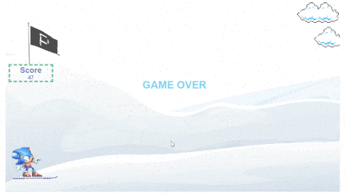

  

## Practicum SnowGame

📝Este é um projeto que simula um jogo com técnicas replicadas do vídeo ["Como criar um jogo SIMPLES usando JavaScript e HTML | JavaScript para iniciantes - Tutorial"](https://www.youtube.com/watch?v=r9buAwVBDhA).

Foi desenvolvido como estudo complementar do curso de desenvolvedor web da [Practicum](https://practicum.yandex.com/profile/web/).

- [Link para o projeto no Github Pages](https://renanl23.github.io/practicum-snowgame/)

### Tecnologias usadas

